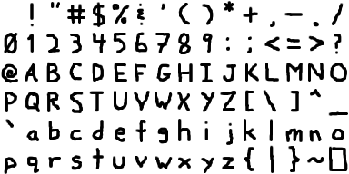

If you want to be more creative about the fonts in your game you can create a sprite sheet of your font like this

 

and chop it up in Crafty like this 

```
Crafty.init();

Crafty.sprite(24,32,"http://opengameart.org/sites/default/files/font-hand-24x32.png",
              {
                  EMPTY:[0,0],
                  A:[1,2],
                  B:[2,2],
                  C:[3,2],
                  D:[4,2],
                  E:[5,2],
                  F:[6,2],
                  G:[7,2],
                  H:[8,2],
                  I:[9,2],
                  J:[10,2],
                  K:[11,2],
                  L:[12,2],
                  M:[13,2],
                  N:[14,2],
                  O:[15,2],
                  P:[0,3],
                  Q:[1,3],
                  R:[2,3],
                  S:[3,3],
                  T:[4,3],
                  U:[5,3],
                  V:[6,3],
                  W:[7,3],
                  X:[8,3],
                  Y:[9,3]
              });

Crafty.c("Char",{
    init:function(){
        this.addComponent("2D,DOM").attr({w:24,h:32});
    }
});

Crafty.c("SpriteText",{
    init:function(){
        this.addComponent("2D,DOM");
    },
    text:function(text){
        var c;
        for(var i = 0; i<text.length;i++){
            c = Crafty.e("Char",text.charAt(i).toUpperCase());
            c.shift(i*c.w);
            this.attach(c);
        }
    }
});
```
Then simply use the SpriteText component like this

```
var text = Crafty.e("SpriteText").text("Crafty Roxx");
```

And the result

<iframe width="600" height="300" src="examples/textsprite/textsprite.html">
	This is an iframe. sorry.
</iframe>